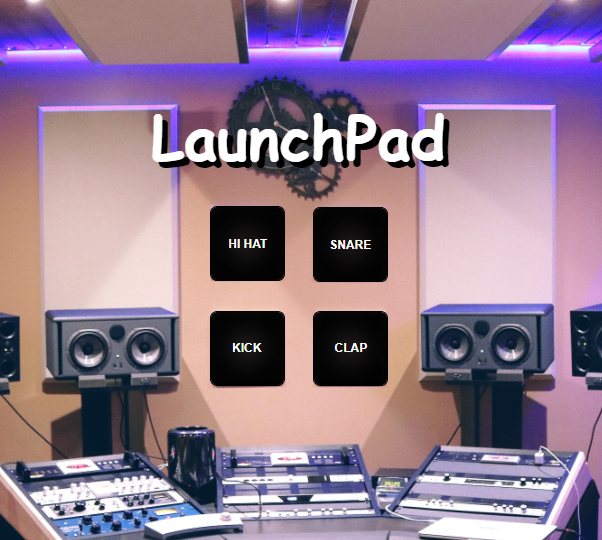

# LauchPad | Drum Pad

<!---Esses são exemplos. Veja https://shields.io para outras pessoas ou para personalizar este conjunto de escudos. Você pode querer incluir dependências, status do projeto e informações de licença aqui--->

### Ajustes e melhorias

O projeto ainda está em desenvolvimento e as próximas atualizações serão voltadas nas seguintes tarefas:

- [x] Buttons
- [x] Audio
- [x] Layouts
- [ ] Reponsivo

<a href="https://almirjrdev.github.io/Lauchpad-DrumPad/">GitPages 💻

